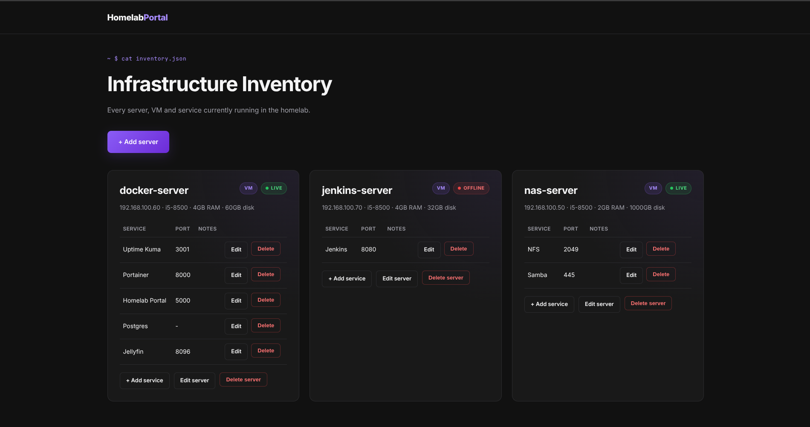
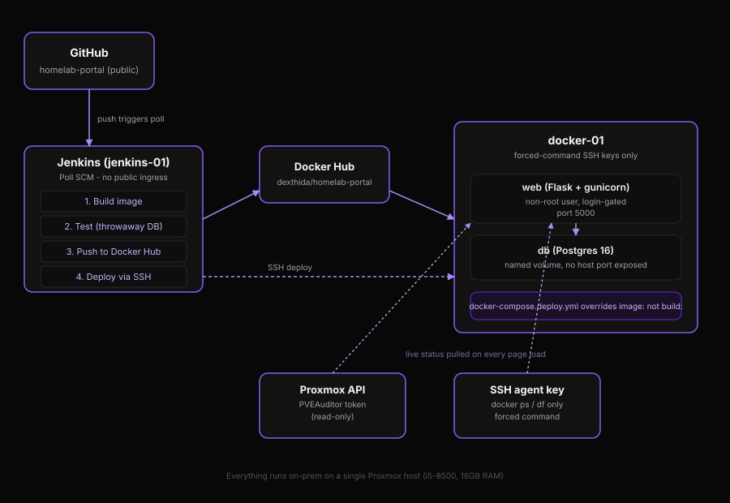

# Homelab Portal

A two-tier web application that tracks and monitors my homelab infrastructure; servers, VMs, and Docker services with live data pulled from Proxmox and SSH, not manually maintained facts. Built as the third project in a series exploring AWS cloud infrastructure, on-prem CI/CD, and containerized application delivery.

**Stack:** Flask + PostgreSQL, Docker, Jenkins, deployed entirely on-prem on a Proxmox homelab.

## What it does

- Tracks every server/VM in the homelab: hardware specs, IP, notes — full CRUD
- Tracks services running on each server, with port and notes — full CRUD
- Shows **real** live status per server, not a manual toggle:
  - If a Proxmox VMID is set, status and uptime come directly from the Proxmox API
  - Otherwise, falls back to a TCP port-check (port 22) as a basic reachability test
- Shows **real** live Docker container status and disk usage for the Docker host, pulled over SSH using a key that can do nothing except run those two specific commands
- Login-gated (session-based, hashed password) — not open to anyone who finds the IP
- Deploys itself: push to `main`, and within minutes the change is built, tested against a real throwaway database, pushed to a registry, and running

## Architecture

**Two VMs, one shared purpose:**
- `jenkins-01` — runs Jenkins in Docker, does nothing else. Kept deliberately separate from where the app actually runs, so a compromised build never has a direct path to the deploy target's other services.
- `docker-01` — runs the actual app (`web` + `db` containers) alongside the rest of my existing homelab stack (Jellyfin, Uptime Kuma, Portainer).

**Two-tier by design, not by default:**
- `db` (Postgres 16) holds the only genuinely persistent state — inventory facts, service notes, login credentials — in a named volume, with **no port published to the host**, reachable only from `web` over Docker's internal network.
- `web` (Flask + gunicorn) is stateless and disposable — every request either reads/writes the DB, or reaches out live to Proxmox/SSH, computes the page, and forgets everything.

## CI/CD pipeline

Every push to `main` runs a real four-stage Jenkins pipeline:

1. **Build** — `docker build`, tagged both with the Jenkins build number (for rollback) and `latest`
2. **Test** — spins up a *throwaway* Postgres and the newly built image on an isolated Docker network, polls the image's own `HEALTHCHECK` until it reports healthy (or fails loudly with logs if it never does), then tears everything down regardless of outcome
3. **Push** — only reached if Test passed; pushes both tags to Docker Hub using a token scoped to Read & Write only
4. **Deploy** — SSHes into `docker-01` using a key that is cryptographically restricted (via a forced `command=` in `authorized_keys`) to running exactly one script, which pulls the new image and recreates the container — nothing else is possible with that key even if it leaked

**Trigger mechanism is Poll SCM, not a GitHub webhook** — a deliberate choice, not an oversight: there's no port forwarding into this homelab (by design, in favor of Tailscale for remote access), so GitHub has no way to reach Jenkins directly. Jenkins polling GitHub every 5 minutes needs no inbound exposure at all, which is the same pattern real CI systems use behind a corporate NAT.

## Security model

Every credential in this project is scoped to the minimum it needs, not the account it came from:

| Credential | Scope |
|---|---|
| Proxmox API token | `PVEAuditor` role — read-only, can see status but can't start/stop/modify anything |
| SSH "agent" key (live Docker/disk data) | Forced command — can only run `docker ps` and `df`, nothing else, no shell |
| SSH "deploy" key (Jenkins → docker-01) | Forced command — can only run the redeploy script, nothing else |
| Docker Hub token | Read & Write only, not admin |
| App login | Session-based, password stored as a `werkzeug`/scrypt hash, never plaintext |

Other decisions worth naming explicitly:
- The container runs as a non-root user, not root
- `gunicorn` in production, not Flask's dev server (which ships an interactive debugger — a real code-execution risk if ever reachable)
- Secrets (`.env`, the SSH private keys) are excluded from both `.gitignore` *and* `.dockerignore` — the second one matters separately, since `.gitignore` only protects Git history, not what `COPY . .` bakes into an image layer
- CSRF protection (e.g. Flask-WTF) is **not** implemented — a deliberate, documented scope call for a single-user tool on a private LAN behind login, not an oversight

## An honest incident, and what came of it

During CI/CD debugging, a private deploy key was pasted into a third-party AI chat while troubleshooting — a mistake, caught immediately, treated as a compromised credential regardless of the platform's actual retention policy. The key was rotated: the old public key removed from `docker-01`'s `authorized_keys`, a new key generated, and the Jenkins credential updated in place. The forced-command restriction meant the actual exposure window carried limited real risk (the key could only ever trigger a redeploy, nothing else) — but "limited risk" isn't the same as "no action needed," and it wasn't treated as such.

## Known bugs found and fixed along the way

- **gunicorn multi-worker race condition**: `db.create_all()` ran at module import time, which meant *every* gunicorn worker executed it independently on startup. Against a genuinely empty database (as the Test stage always uses), two workers raced to create the same table simultaneously and one lost, crashing on a duplicate-key error. Fixed with `preload_app = True` so initialization runs once in the master process before forking, plus a `post_fork` hook to give each worker its own fresh DB connection (inherited connections aren't safe to share across forked processes).
- **Docker Compose `$` interpolation**: `scrypt` password hashes contain `$` delimiters, which Compose interprets as the start of a variable reference. Fixed by escaping them as `$$` in `.env`.

## What's next

- Backup status pulled from Proxmox's own backup job history (extends the existing API integration)
- A second, separate Jenkins build agent, so the controller itself never has direct Docker socket access — the real-company-scale version of the tradeoff documented above
- A genuine push-based GitHub webhook via a tunnel service (e.g. `smee.io`), replacing Poll SCM's up-to-5-minute delay with an instant trigger
